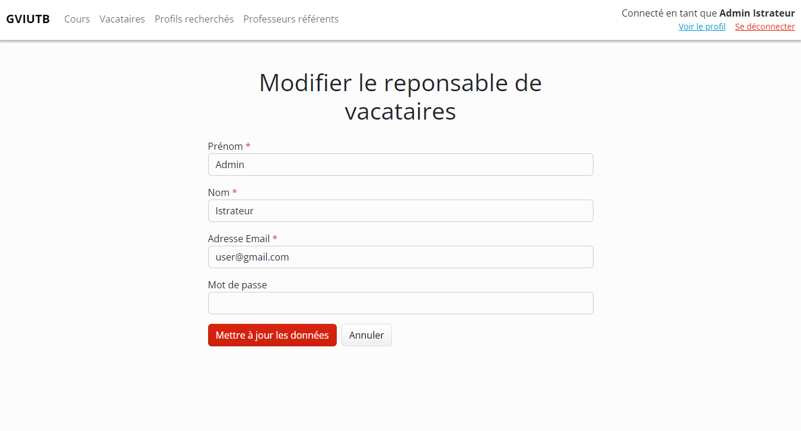
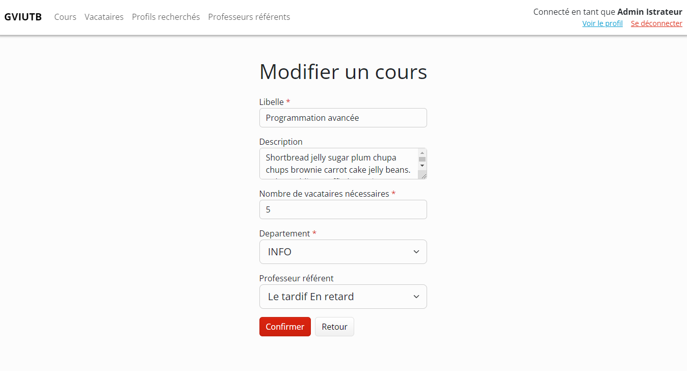
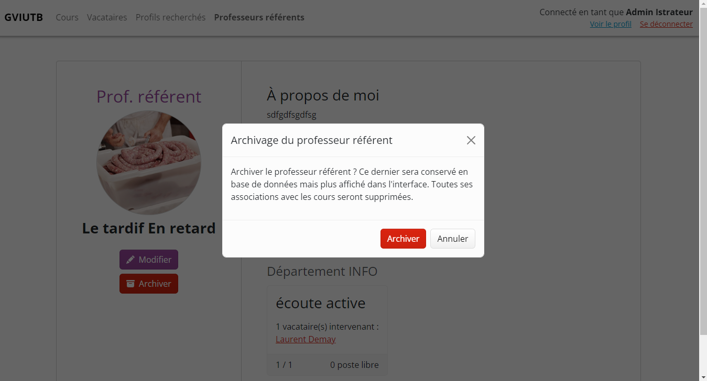

= Documentation utilisateur
:toc:
:toc-title: Sommaire
:toclevels: 3

== I. Contexte et concept
L'administration de l'IUT de Blagnac souhaite disposer d'un outil lui permettant de gérer ses vacataires, les cours sur lesquels ils interviennent, mais aussi les profils de vacataires recherchés. La solution technique développée (GVIUTB) permet à des responsables de vacataires d'ajouter/modifier, visualiser, et supprimer (archiver) des vacataires, des cours, des professeurs référents et des profils de vacataires recherchés, tout en assurant la sécurité des données manipulées.

Ce document détaille l'ensemble des fonctionnalités proposées par l'application et comment les utiliser.

{empty} +

== II. Accès à l'application web
L'application doit être accessible depuis un serveur web local ou en ligne et sécurisé (HTTPS) pour assurer la confidentialité des données.

Voir les link:Installation_et_déploiement.adoc[prérequis et installations nécessaires au déploiement de l'application] si besoin.

{empty} +

== III. Description des fonctionnalités
NOTE: *Disclaimer :* les profils visibles sur les captures d'écran affichées dans ce document sont fictifs et ont été créés uniquement pour tester les fonctionnalités de l'application.

=== 1. Formulaire de connexion
Il n'est pas possible d'accéder aux pages de l'application ni même aux routes de données de l'API utilisées pour récupérer et mettre à jour des données (link:Structure_et_description_technique.adoc[voir la documentation technique]) tant que l'utilisateur n'est pas connecté en tant que vacataire ou en tant que responsable de vacataires.

Le formulaire de connexion est donc la première page présentée aux utilisateurs souhaitant utiliser l'application.

==== 1.1. Connexion en tant que vacataire
L'utilisateur peut se connecter en tant que vacataire avec les identifiants correspondants. Il ne pourra qu'accéder à son profil de vacataire et modifier ses propres données. Il pourra également s'associer et se dés-associer à des cours et des compétences.

==== 1.2. Connexion en tant que responsable de vacataires
L'utilisateur peut se connecter en tant responsable de vacataires avec les identifiants correspondants. Les responsables agissent comme des administrateurs, ils peuvent visualiser les données de tous les vacataires, des cours, des profils recherchés et des professeurs référents. Ils peuvent également consulter et modifier leurs données mais pas celles des autres responsables.

Appart pour la consultation et la modification des données des vacataires, toutes les autres fonctionnalités décrites par la suite ne sont accessibles qu'aux responsables de vacataires.

{empty} +

=== 2. Gestion des vacataires
==== 2.1. Listage et filtrage des vacataires
Il est possible d'accéder à une liste de tous les vacataires intervenant ou postulant à l'IUT. Ces derniers peuvent également être filtrés en fonction de leur statut et de leurs compétences.

==== 2.2. Ajout et modification d'un vacataire
Il est possible d'ajouter et de modifier les données d'un vacataire avec un seul et même formulaire s'adaptant en fonction du mode (ajout/modification). Le prénom, le nom, l'adresse email et le mot de passe sont obligatoires lors de la saisie des données. Une image et un CV peuvent aussi être ajoutés au vacataire.

En mode 'modification', le mot de passe, l'image et le CV ne seront mis à jour que lorsque des données sont entrées dans les champs correspondants. Les données de l'image et du CV peuvent être supprimées à tout moment. Si l'ID saisi dans l'URL ne correspond à aucun vacataire, l'utilisateur sera redirigé vers la page de listage des vacataires.

Les vacataires ne peuvent modifier que les données de leur profil.

==== 2.3. Consultation du profil d'un vacataire
Il est possible de consulter toutes les données d'un vacataire, dont celles des compétences et des cours qui lui sont associés. Si l'ID saisi dans l'URL ne correspond à aucun vacataire, l'utilisateur sera redirigé vers la page de listage des vacataires ou celle de consultation de son profil (pour les vacataires).

image::images/image-2023-10-19-20-43-27-539.png[,700]

==== 2.4. Ajout de formations
Il est possible d'ajouter ou de supprimer des formations à un vacataire dans la page de consultation de son profil via le champ "Nouvelle formation" ou en survolant une formation existante.

==== 2.5. Association avec des compétences
Il est possible d'associer ou de dés-associer des compétences à un vacataire dans la page de consultation de son profil via le champ "Nouvelle compétence" ou en survolant une compétence existante. Une liste des compétences existante sera proposée lors de la saisie.

==== 2.6. Recruter un vacataire postulant
Il est possible de faire passer un vacataire du statut de postulant à intervenant en cliquant sur le bouton "Recruter". Sa date de recrutement sera mise à jour et il sera possible de l'associer à des cours.

==== 2.7. Association avec des cours
Il est possible d'associer ou de dés-associer des cours à un vacataire dans la page de consultation de son profil en sélectionnant un département puis un cours dans la section "Faire intervenir sur un nouveau cours", ou en cliquant sur l'icône poubelle en survolant un cours existant.

Seuls les cours non-archivés et avec un nombre suffisant de postes peuvent être associés aux vacataires.

==== 2.8. Archivage d'un vacataire
Il est possible d'archiver un vacataire en cliquant sur le bouton "Archiver" dans la page de consultation de son profil. Ce dernier existera toujours dans la base de données, mais il n'apparaitra plus dans l'interface de l'application et toutes ses associations avec les cours et les compétences seront supprimées.

{empty} +

Les fonctionnalités décrites par la suite ne sont accessibles qu'aux responsables de vacataires.

=== 3. Gestion des cours
==== 3.1. Listage et filtrage des cours
Il est possible d'accéder à une liste de tous les cours proposés à l'IUT. Ces derniers peuvent également être filtrés par département et professeurs référents.

==== 3.2. Ajout et modification d'un cours
Il est possible d'ajouter et de modifier les données d'un cours avec un seul et même formulaire s'adaptant en fonction du mode (ajout/modification). Le libellé, et le département sont obligatoires lors de la saisie des données.

En mode 'modification', si l'ID saisi dans l'URL ne correspond à aucun cours, l'utilisateur sera redirigé vers la page de listage des cours.

==== 3.3. Consultation d'un cours
Il est possible de consulter toutes les données d'un cours, dont celles des vacataires qui interviennent dessus. Si l'ID saisi dans l'URL ne correspond à aucun cours, l'utilisateur sera redirigé vers la page de listage des cours.

==== 3.4. Archivage d'un cours
Il est possible d'archiver un cours en cliquant sur le bouton "Archiver" dans sa page. Ce dernier existera toujours dans la base de données, mais il n'apparaitra plus dans l'interface de l'application et toutes ses associations avec les vacataires seront supprimées.

{empty} +

=== 4. Gestion des profils recherchés
==== 4.1. Listage et filtrage des profils recherchés
Il est possible d'accéder à une liste de tous profils de vacataires recherchés à l'IUT. Ces derniers peuvent également être filtrés en fonction des compétences recherchées.

==== 4.2. Ajout et modification d'un profil recherché
Il est possible d'ajouter et de modifier les données d'un profil recherché avec un seul et même formulaire s'adaptant en fonction du mode (ajout/modification). Seul le libellé est obligatoire lors de la saisie.

En mode 'modification', si l'ID saisi dans l'URL ne correspond à aucun profil, l'utilisateur sera redirigé vers la page de listage des profils recherchés.

==== 4.3. Consultation d'un profil recherché
Il est possible de consulter toutes les données d'un profil recherché, dont celles des vacataires postulants correspondant. Si l'ID saisi dans l'URL ne correspond à aucun profil, l'utilisateur sera redirigé vers la page de listage des profils recherché.

==== 4.4. Association avec des compétences
Il est possible d'associer ou de dés-associer des compétences à un profil recherché dans sa page de consultation via le champ "Nouvelle compétence" ou en survolant une compétence existante. Une liste des compétences existante sera proposée lors de la saisie.

==== 4.5. Archivage d'un profil recherché
Il est possible d'archiver un cours en cliquant sur le bouton "Archiver" dans sa page. Ce dernier existera toujours dans la base de données, mais il n'apparaitra plus dans l'interface de l'application.

{empty} +

=== 5. Gestion des professeurs référents
==== 5.1. Listage des professeurs référents
Il est possible d'accéder à une liste de tous professeurs référents de l'IUT.

==== 5.2. Ajout et modification d'un professeur référent
Il est possible d'ajouter et de modifier les données d'un professeur référent avec un seul et même formulaire s'adaptant en fonction du mode (ajout/modification). Le prénom, le nom et l'adresse email sont obligatoires lors de la saisie des données. Une image peut être ajoutée au profil.

En mode 'modification', le mot de passe et l'image ne seront mis à jour que lorsque des données sont entrées dans les champs correspondants. Les données de l'image peuvent être supprimées à tout moment. Si l'ID saisi dans l'URL ne correspond à aucun professeur référent, l'utilisateur sera redirigé vers la page de listage des professeurs référents.

==== 5.3. Consultation du profil d'un professeur référent
Il est possible de consulter toutes les données du profil d'un professeur référent, dont celles des cours auxquels ils sont associés. Si l'ID saisi dans l'URL ne correspond à aucun profil, l'utilisateur sera redirigé vers la page de listage des professeurs référents.

==== 5.4. Archivage d'un professeur référent
Il est possible d'archiver un professeur référent en cliquant sur le bouton "Archiver" dans sa page. Ce dernier existera toujours dans la base de données, mais il n'apparaitra plus dans l'interface de l'application et sera dés-associé de tous les cours sur lesquels il intervenait.

{empty} +

=== 6. Consultation et modification du profil d'un responsable de vacataires
Il est possible pour un responsable de vacataires de consulter et modifier les données de son compte et seulement le sien. prénom, le nom et l'adresse email sont obligatoires lors de la saisie des données. Le mot de passe ne sera mis à jour que lorsque des données sont entrées dans le champ correspondant.

Pour l'ajout ou l'archivage de responsables de vacataires, voir la link:Structure_et_description_technique.adoc[documentation technique] traitant de ce sujet.
